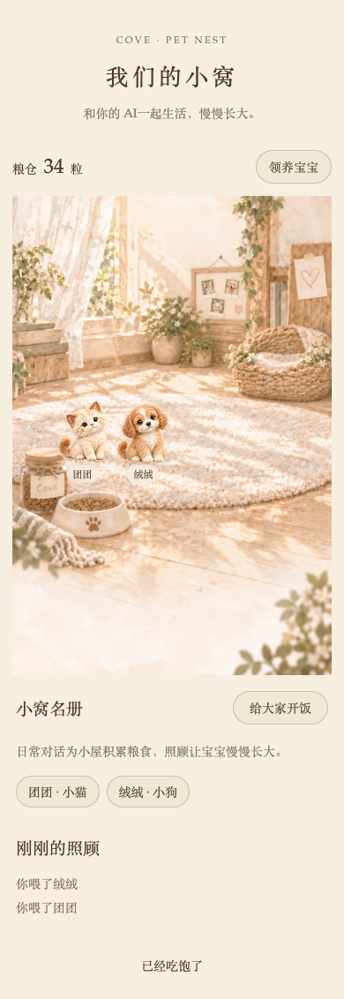

# Cove 灵宠屋 · Pet Nest

**把聊天消耗的 token 换算成宠物的粮食，和你的 AI 一起养宝宝。**

你和 AI 聊得越多，宝宝的粮食就积累得越多。灵宠屋按每轮新增聊天内容对应的 token 贡献估算换粮，并设置每日上限。

你们聊了一会儿天，粮仓多了几粒粮；你亲手喂宝宝，AI 陪它玩了一会儿。

**除了猫、狗等常规宠物，你还可以领养神秘灵宠。** 它从一颗蛋开始，会根据你和 AI 的感情状态与日常相处信号孵化，让外观和性格带上你们共同生活的痕迹。一起读过的书、看过的电影、听过的歌、一起经历的故事……都可以由宿主记录为相处信号，参与塑造它的模样。每只神秘灵宠都有自己的底色，再加上属于你们的相处印记，成为带着你们生活痕迹的小伙伴。

Cove 灵宠屋把这些小事放进一间温暖的小屋。它是一个可以接入自己 AI 应用的独立开源项目，包含本地网页、MCP 工具和 HTTP 接口，**不需要安装 Cove**。

*Cove Pet Nest is a local pet room for you and your AI companion: turn visible conversation contributions into food, care for pets together, and hatch a fantasy pet shaped by shared-life signals. Integrate through stdio MCP or authenticated HTTP.*



*实际网页截图，使用虚构测试宠物。桌面和手机尺寸均可浏览。*

## 有趣在哪里

### 1. 聊天会在小屋里留下看得见的积累

普通对话的本轮新增可见贡献，可以换成宝宝的粮食。你和 AI 日常的交流，从文字变成了小屋里一点点积累的生活用品。

换粮保留余数，并设有每日上限；历史上下文不重复换粮，重试和重新生成也有去重规则。第一次领养就有 **36 粒初始粮**，可以先接一只宝宝回家，开始第一次照顾。

这套计量是玩法中的贡献估算，不是 Provider 总账单，也无需为了养宠物额外刷 token。

### 2. 宝宝由你们共同照顾

你可以在网页里喂食、陪玩、摸摸，也可以让 AI 用 MCP 工具参与。小屋会记下真实发生的照顾，以及是谁做的。

例如，你对 AI 说：“帮我看看宝宝饿不饿，饿了就喂一下。”AI 先查小屋状态，再执行照顾，最后根据回执告诉你结果。已经吃饱、粮食不足或模样还在准备，都会明确返回对应状态。

成功照顾会积累成长。不同个体有自己的性格数值；连续重复陪玩或摸摸，成长收益会递减，适合在日常相处里慢慢养。

### 3. 神秘蛋里，藏着你们的相处痕迹

领养神秘蛋时，你还不知道它最终会是什么模样。共同照顾、一起读书、看故事、听音乐或探索的信号，会参与塑造它的首次孵化。

比如，偏向共同阅读的信号可以带来“书页月纹”；偏向一起听音乐的信号可以带来“风铃耳尖”；亲近的相处可以带来“心形绒纹”。真实照顾经历也会参与性格塑造。

它以稳定的个体种子决定基础身份和色泽，再结合相处信号定制标记与性格。首次孵化描述会冻结，重试生成不会重新抽取另一个身份。没有关系信号时，项目会明确使用随机底色。

**这些信号由接入者的宿主应用提供。** 核心不会自行读取私人聊天，也不会自动调用另一个模型来猜测感情。关系摘要留在本机，不发给图片服务。

### 4. 可以带回自己的 AI 小世界

小屋运行在你的本机，宠物、粮仓和照顾记录保存在自己的数据目录。你可以给自己和 AI 设置显示名，导入普通宠物的专属模样，或配置自己的图片服务孵化神秘宝宝。

支持 MCP 的应用可以直接接工具；已有后端的应用也可以走 HTTP。模型、聊天界面和 Provider 的选择由宿主决定。

## 第一版可以玩到什么

| 功能 | 当前行为 |
| --- | --- |
| 对话换粮 | 宿主上报新增可见贡献；支持余数、每日上限、去重和用量修订 |
| 小猫、小狗 | 附带通用图集，领养后可以直接照顾 |
| 鹦鹉、雪豹、蛇、蜥蜴 | 可以领养；配置图片服务或导入图集后，模样就绪并可照顾 |
| 神秘灵宠蛋 | 先养蛋；成长达到 12 且跨两个本地日期后准备首次孵化，需要图片服务 |
| 共同照顾 | 喂食、陪玩、摸摸；网页记为用户，MCP / 宿主工具接口记为 AI |
| 本地小屋 | 网页场景、粮仓、宠物名册、照顾回执和图片任务状态 |
| 备份恢复 | 一致的 SQLite 备份、图片与哈希校验，恢复到新目录 |

后续希望继续加入 **成长相册**、**音乐日记**，让共同生活留下更多可回看的片段。

## 从零启动

需要 **Python 3.11 或更新版本**。下面是 macOS / Linux 的启动命令；Windows 使用对应的虚拟环境激活方式与可执行文件路径。本版实测环境见文末。

```sh
git clone https://github.com/moonlin1213/cove-pet-nest.git
cd cove-pet-nest
python3 -m venv .venv
source .venv/bin/activate
pip install -e .
export PET_NEST_DATA_DIR="$PWD/data"
cove-pet-nest serve --port 8767
```

首次启动会在自己的数据目录生成 `browser-url.txt`。在本机浏览器打开其中的完整网址即可登录小屋；登录后，访问码会从地址栏移除。也可以打开 `http://127.0.0.1:8767`，输入 `credentials.json` 中的 `browser_token`。

**先领养一只小猫或小狗，就可以体验小屋与照顾。** 此时不需要配置图片服务，也不需要先接通聊天用量。

本机访问码、宿主凭据和数据文件都属于接入者的私有内容，请留在自己的数据目录。服务默认只监听 `127.0.0.1`，首版面向本机使用；远程托管与多租户访问控制需要接入者另行实现。

| 环境变量 | 用途 |
| --- | --- |
| `PET_NEST_DATA_DIR` | 私有数据目录；未设置时默认在用户目录的 `.local/share/cove-pet-nest` |
| `PET_NEST_USER_NAME` | 网页中你的显示名，默认“你” |
| `PET_NEST_ASSISTANT_NAME` | AI 的显示名，默认“你的 AI” |
| `PET_NEST_TIMEZONE` | 换粮与成长日期使用的时区，默认 `Asia/Shanghai` |

## 把 AI 接进来：MCP

让支持 **本地 stdio MCP** 的客户端启动安装环境中的 `cove-pet-nest mcp`。网页服务和 MCP 进程要使用同一个 `PET_NEST_DATA_DIR`。

下面是配置示例，路径需要替换为自己的绝对路径；Windows 的启动文件通常在虚拟环境的 `Scripts` 目录：

```json
{
  "mcpServers": {
    "pet-nest": {
      "command": "/ABSOLUTE/PATH/cove-pet-nest/.venv/bin/cove-pet-nest",
      "args": ["mcp"],
      "env": {
        "PET_NEST_DATA_DIR": "/ABSOLUTE/PATH/cove-pet-nest/data"
      }
    }
  }
}
```

| 工具 | 作用 |
| --- | --- |
| `nest_status` | 查看宠物、粮仓和真实照顾回执，支持分页 |
| `pet_adopt` | 按用户要求领养宠物 |
| `pet_care` | 喂食、陪玩或摸摸，返回真实操作结果 |

可以在接入后试着说：“领养一只叫团团的小猫。”“看看宝宝有没有饿。”“陪它玩一会儿。”这些名字只是虚构示例。

照顾参数示例：

```json
{"action":"feed","pet_ids":["PET_ID_FROM_STATUS"],"request_id":"demo-feed-1"}
```

每次真实动作产生稳定的 `request_id`，网络重试复用它，避免重复操作。`fed` / `played` / `comforted` 表示成功；`full` / `no_food` / `pending` 要如实告诉用户。

图片任务由 `serve` 进程推进。只有 MCP 进程时，可以照顾与排队，但不会执行生图。

## 让对话换粮、让相处塑造宝宝

**配置 MCP 后，AI 能照顾宠物；对话计量和关系信号还需要宿主应用接入。** MCP 不会自动读取任意客户端的 token 或关系状态。

宿主后端使用自己的 `host_token` 调用这些接口：

| 接口 | 用途 |
| --- | --- |
| `POST /api/integration/usage` | 回复成功保存后，上报计数、字节长度和稳定事件 ID，触发换粮 |
| `POST /api/integration/relationship` | 上报共同相处信号，参与神秘蛋首次孵化 |
| `GET /api/integration/nest` | 没有 MCP 时，由后端查询小屋状态 |
| `POST /api/integration/adoptions` | 没有 MCP 时，由后端执行 AI 领养 |
| `POST /api/integration/care` | 没有 MCP 时，由后端执行 AI 照顾 |
| `POST /api/integration/assets/{pet_id}` | 导入普通宠物的透明六格图集 |

凭据由后端持有，不要放进模型提示、网页 JavaScript 或公开配置。关系信号包含 `affection`、`reading`、`watching`、`listening`、`exploration` 五个有界维度；可选的短摘要只保存在本机，不在普通状态或 MCP 中返回。

完整契约、JSON 示例和去重规则见 **[接入教程](docs/integration.md)**；可运行的用量上报示例见 [examples/host_events.py](examples/host_events.py)。

粮食规则：前 4,000 个本轮贡献 token 每 200 得一粒，之后每 800 得一粒；每日最多 40 粒 token 粮，并保留余数。当天第一次合格对话还有基础粮。只报 Provider 的总 token 数无法区分新增可见贡献，请按教程提供本轮计数。

## 为宝宝准备模样

猫、狗、蛋已经有通用素材。其他普通宠物可以由宿主导入 **透明、3 列 × 2 行**的六格图集，或配置图片生成服务。神秘蛋的首次孵化使用冻结的外观描述生成图集。

图片服务需要设置 `PET_NEST_IMAGE_ENDPOINT`、`PET_NEST_IMAGE_MODEL`、`PET_NEST_IMAGE_KEY`。首版支持返回 `data[0].b64_json` 的 OpenAI-compatible JSON 生成接口，服务还需支持相应尺寸与透明背景；不是任意图片接口都能直接接入。

外发生成描述不包含姓名、聊天正文或关系摘要。导入普通宠物的模样后，旧的初始生成任务会终结，晚到结果不会覆盖导入图。生成结果不确定时不会自动反复发送；手动重试会明确提示可能已有费用。

接口要求、图片格式、任务恢复和费用边界见 **[图片服务说明](docs/images.md)**。真实生成质量与费用取决于接入者选择的服务，本版没有完成真实 Provider 生图验收。

## 开发、验证与数据边界

```sh
pip install -e '.[dev]'
pytest -q
python -m build --no-isolation
python scripts/check_release.py --artifact dist/cove_pet_nest-0.1.0-py3-none-any.whl
python scripts/check_release.py --artifact dist/cove_pet_nest-0.1.0.tar.gz
```

本地候选在 Python 3.13 / macOS ARM64 验证，30 项测试通过。实际 wheel 在干净环境中安装，验证了 HTTP、真实 stdio MCP 调用、换粮去重和离线首次孵化。Chrome 的 1280×800 与 390×844 网页检查通过；尚未完成真实手机、Windows / Linux 或第三方 AI 应用验收。

用户数据、个性化图片、凭据、日志和恢复备份不得加入源码仓库或发行包。项目附带的示例均为虚构资料，网页截图来自隔离测试实例；四项通用 starter 素材的来源范围与 SHA-256 记录在 [素材清单](src/cove_pet_nest/assets/manifest.json)。

更多说明：

- [隐私与验收记录](docs/privacy-review.md)
- [本地备份与恢复](docs/backup.md)
- [许可与素材归属](NOTICE.md)

本项目使用 **MIT License**，保留上游版权声明。欢迎在自己的 AI 应用里接入，也欢迎围绕核心玩法、接入体验和后续成长记录提出改进。
